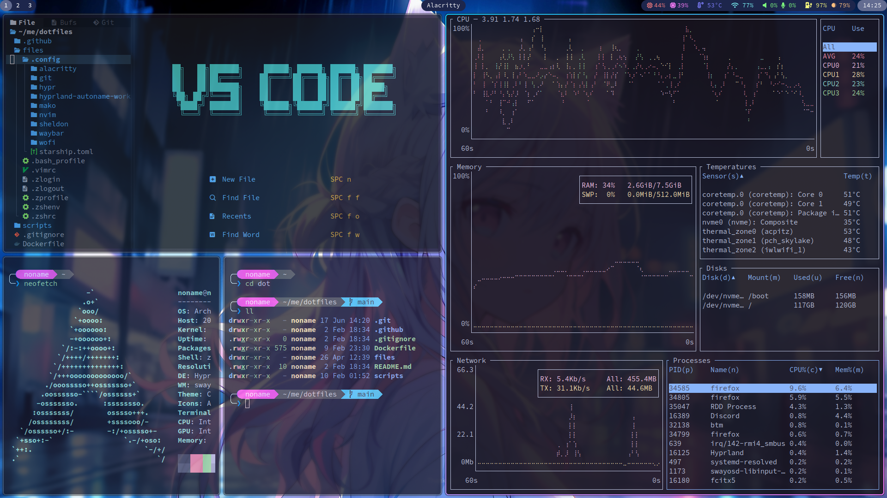

# n4mlz's Dotfiles 🧊

This is my Dotfiles repository with install scripts for Arch Linux and Ubuntu!
This also provides a set of CLI tools, and can be deployed to SSH-accessible servers, WSL, or containers.
(Note: The installation scripts may not function correctly. Proceed at your own risk.)

## Environment 🌱
### GUI 🖥️
- [Hyprland](https://github.com/hyprwm/Hyprland) _**(Window Manager)**_
- [hyprpaper](https://github.com/hyprwm/hyprpaper) _**(Wall Paper)**_
- [Waybar](https://github.com/Alexays/Waybar) _**(Status Bar)**_
- [wofi](https://hg.sr.ht/~scoopta/wofi) _**(Application Launcher)**_
- [mako](https://github.com/emersion/mako) _**(Notifications)**_
- [Alacritty](https://github.com/alacritty/alacritty) _**(Terminal Emulator)**_
- [Thunar](https://docs.xfce.org/xfce/thunar/start) _**(File Manager)**_
- [gtklock](https://github.com/jovanlanik/gtklock) _**(Lock Screen)**_
- [SwayOSD](https://github.com/ErikReider/SwayOSD) _**(OSD)**_
- [Catppuccin](https://github.com/catppuccin) _**(Theme)**_
- [cliphist](https://github.com/sentriz/cliphist) _**(Clipboard Manager)**_

### CLI ⌨
- [zsh](https://www.zsh.org/) _**(Shell)**_
- [AstroNvim](https://github.com/AstroNvim/AstroNvim) _**(Text Editor)**_
- [sheldon](https://github.com/rossmacarthur/sheldon) _**(Zsh Plugin Manager)**_
- [Starship](https://github.com/starship/starship) _**(Prompt)**_
- [mise](https://github.com/jdx/mise) _**(Environment Setup Tool)**_
- [bat](https://github.com/sharkdp/bat) _**(replacement for `cat`)**_
- [eza](https://github.com/eza-community/eza) _**(replacement for `ls`)**_
- [zoxide](https://github.com/ajeetdsouza/zoxide) _**(replacement for `cd`)**_
- [bottom](https://github.com/ClementTsang/bottom) _**(replacement for `bottom`)**_

## Installation ✅

Installation scripts automatically detect whether you are using Arch Linux, Ubuntu, WSL, or a Docker container, and perform the optimal installation for each respective environment.

(Warning: Understand that the installation scripts may be incomplete, and proceed at your own risk.)

- To create symbolic links only: `./scripts/deploy.sh`
- For a minimal installation and create symbolic links: `./scripts/install.sh`
- To selectively install individual tools: `./scripts/dev/[tool-to-install].sh`

## Features 🪶

### Supports various environments 🌿

This Dotfiles provides a set of CLI tools, and can be deployed to SSH-accessible servers, WSL, or containers.

### Smart Installation 📥

Installation scripts automatically detect whether you are using Arch Linux, Ubuntu, WSL, or a Docker container, and perform the optimal installation for each respective environment.

### Smart Screen Shot Operations 📱

My Dotfiles provide a simple and efficient key configuration to define and execute screen capture areas and functionalities.

The following key combinations with the `PrtSc` key will execute a screen capture:

- `Shift`: Toggles between capturing the active window or the full screen
- `Ctrl`: Toggles between saving the capture or not
- `Alt`: Toggles between capturing a user-specified area or not

Additionally, the screen capture will always be saved to the clipboard, regardless of the above flags.

For example:

- `PrtSc`: Saves the active window to the clipboard
- `Shift` + `PrtSc`: Saves the full screen to the clipboard
- `Ctrl` + `Alt` + `PrtSc`: Saves a user-selected rectangular area to both the clipboard and a file

When saving to a file, the directory ~/me/pics/screenshot is automatically generated, with the subdirectory named after the current running process (e.g. ~/me/pics/screenshot/firefox).

### (Unfinished) Try my Dotfiles with Docker 🐳

You can try a Docker container with my Dotfiles deployed from Packages.

(Note: Please be aware that my old version of Dotfiles is currently deployed, as the CI has recently been failing. I will fix this eventually.)

## About me 📨
- Twitter: [@n4mlz](https://x.com/n4mlz)
- GitHub: [@n4mlz](https://github.com/n4mlz)
- My Web Site: [n4mlz.dev](https://n4mlz.dev)
